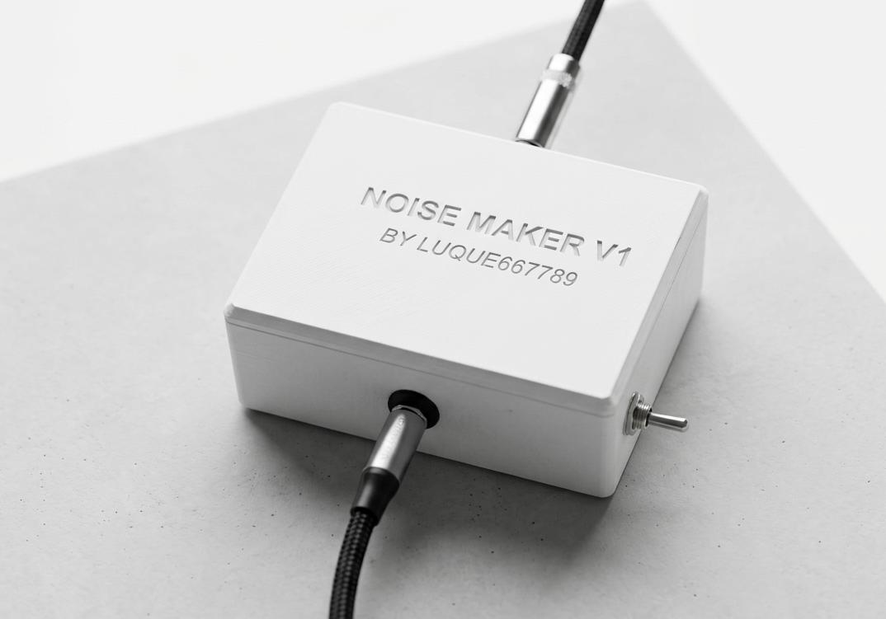

# Noise Maker V1
### Digital Guitar Effect Pedal Prototype with Audio DSP



## Overview

A digital guitar pedal that implements an echo effect on the signal between guitar and amplifier, based on an STM32H7 and custom analog circuits. This is a semester project I built at Hochschule Ravensburg-Weingarten to bring the fundamentals from my theoretical courses (Communication Technology, Computer Technology, Signal Analysis in Time and Frequency Domains, DSP Basics, and Electronic Circuit Design) together into one thing I could plug into and play through (literally :).

Of course this is just a prototype, so there is plenty that can still be improved, especially on the hardware side. More updates will follow as time allows.

The full report and the presentation slides are in [`docs/`](docs/).

## Features

- Real-time audio DSP on a live guitar signal.
- ADC and DAC streaming over DMA, no polling.
- Hardware-timer-driven, interrupt-based sampling pipeline.
- Double-buffering between ADC, memory, and DAC.
- Zero-copy ring buffer for the echo line. Geometric series echo fading.
- Custom analog frontend and backend, designed from scratch around the STM32's built-in converters.
- Filtering before the ADC and after the DAC (sampling-theory-driven, report explains in detail).
- Falstad circuit simulation up front, KiCad schematics for the final design.
- Output noise measured and analyzed in the frequency domain with Audacity (possible sources of noise and future improvements discussed in the report).
- Firmware in C, end-to-end working MVP from analog input to analog output.
- 3D-printed enclosure, 9 V battery powered.

## How it works

The guitar signal is conditioned by an analog frontend, sampled on the STM32H743, processed in real time, and returned through an analog backend to a level the amplifier accepts. A hardware timer drives the sampling, DMA streams the samples in and out with double-buffering, and the delay itself is a ring buffer in memory where only the indexes move. The full design (clock tree, filtering, DSP loop, noise analysis) is explained in detail in the [report](docs/report.pdf). For a high-level overview, see the [presentation slides](docs/presentation.pdf).

## Toolchain

Built with the STM32 toolchain. Peripherals configured in STM32CubeMX, firmware compiled with `arm-none-eabi-gcc` through CMake, flashed over ST-Link.

## What is in this repo

You will find the firmware source code, the KiCad circuit schematics, and the scientific report and presentation slides.

```
.
├── docs/                    slides and scientific report
├── guitar_pedal_software/   STM32H743 firmware
├── kicad/guitarpedalv2/     KiCad schematic and PCB project
└── images/                  schematics, photos, scope captures
```
